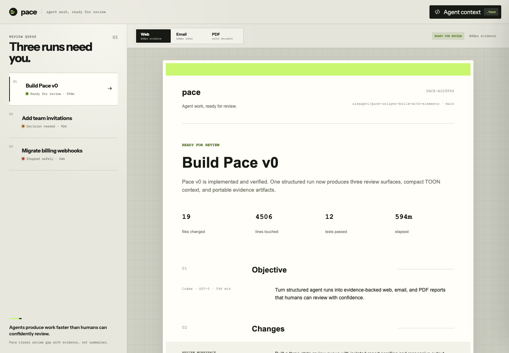
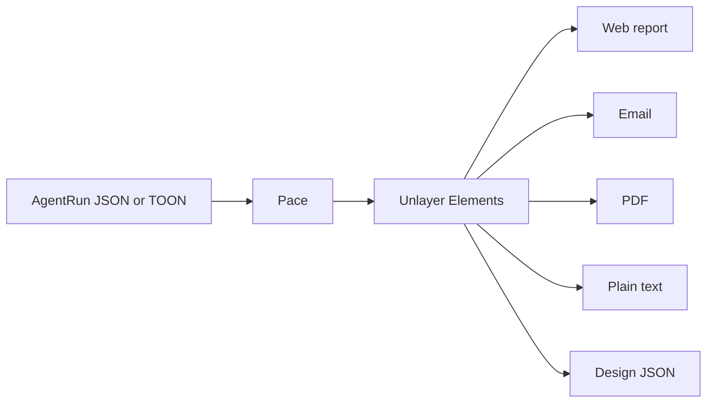

# pace

[](https://github.com/alexapvl/pace-unlayer-build-with-elements/actions/workflows/verify.yml)

**Agents produce work faster than humans can confidently review.**

Pace turns a structured agent run into a review-ready web report, stakeholder email, and audit PDF. Decisions, risks, verification, and receipts stay attached to the work.

[Open Pace](https://pace-unlayer.apvl.dev/) · [Try the demo](https://pace-unlayer.apvl.dev/demo)



## The problem

An agent can change thousands of lines before a human finishes reading the task. The output may include a commit, logs, test results, screenshots, and unresolved decisions, but those receipts are usually scattered across tools.

Pace gives the reviewer one consistent answer to four questions:

1. What did the agent try to do?
2. What changed?
3. What evidence says it worked?
4. Where does a human need to decide?

## One run, three review surfaces

| Surface | Best for |
| --- | --- |
| **Web** | Detailed review with the complete run context |
| **Email** | A compact update for teammates and stakeholders |
| **PDF** | A portable audit record that can be saved or shared |

The same `AgentRun` powers every surface, so the facts do not drift between formats.

Pace also makes the outcome visible before the reviewer reads the details:

| State | Meaning |
| --- | --- |
| **Ready for review** | Work is complete and evidence is collected |
| **Decision needed** | Verified work is waiting on a human choice |
| **Stopped safely** | The agent found unacceptable risk and stopped |

## How it works



1. Pace validates a structured `AgentRun` containing the objective, changes, checks, risks, decisions, timeline, and artifacts.
2. A shared report template maps that run to Unlayer Elements.
3. The template is rendered as a responsive page, email, or print document.
4. The original context remains available as editable JSON or compact TOON.

## Built with Unlayer Elements

Pace uses [`@unlayer/react-elements`](https://github.com/unlayer/elements) as the document system rather than treating the reports as static mockups.

- `Page`, `Email`, and `Document` provide format-specific roots.
- `Row`, `Column`, `Text`, `Button`, `Divider`, and `Image` compose the shared report.
- `renderToHtml` powers the live previews and exported HTML.
- `renderToPlainText` creates a text fallback.
- `renderToJson` produces reusable Unlayer design JSON.

The report template lives in [`src/reports/PaceReport.tsx`](src/reports/PaceReport.tsx), while the format renderers live in [`src/reports/render.tsx`](src/reports/render.tsx).

## Compact agent context with TOON

Pace keeps JSON as its canonical internal format and supports [TOON](https://toonformat.dev/) as a compact, lossless representation for agent input and review pipelines.

Across the three included runs, TOON uses **31% to 34% fewer characters** than pretty-printed JSON. The real Pace dogfood run drops from 5,448 to 3,732 characters, a 31% reduction. Results depend on data shape, so Pace shows the comparison for the current run instead of making a universal token claim.

The context drawer can:

- switch between JSON and TOON;
- edit and validate either representation;
- apply the edited run back to the report;
- verify lossless round trips with strict decoding.

## Real dogfood run

The featured run is not fictional. Pace reviewed the commit that built Pace v0.

| Receipt | Evidence |
| --- | --- |
| Baseline | [`a029f46`](https://github.com/alexapvl/pace-unlayer-build-with-elements/commit/a029f46ff633d8e79b490e9b62c3269b8300835b) |
| Scope | 19 files and 4,506 additions |
| Verification | 12 tests, TypeScript checking, production build, TOON round trips, and browser review |
| CI | [GitHub Actions workflow](https://github.com/alexapvl/pace-unlayer-build-with-elements/actions/workflows/verify.yml) |
| Screenshot | [`screenshot.png`](docs/evidence/pace-v0/screenshot.png) |
| PDF | [`report.pdf`](docs/evidence/pace-v0/report.pdf) |
| TOON context | [`run.toon`](docs/evidence/pace-v0/run.toon) |
| Unlayer design | [`design.json`](docs/evidence/pace-v0/design.json) |

The complete evidence pack is in [`docs/evidence/pace-v0`](docs/evidence/pace-v0).

## Run locally

Requirements: Node.js 22+ and pnpm 9.5.0.

```sh
pnpm install
pnpm dev
```

Open the local URL printed by Vite for the landing page, or add `/demo` for the review workspace. Pace binds to `127.0.0.1` to avoid oversized shared `localhost` cookie headers during development.

### Useful commands

| Command | Purpose |
| --- | --- |
| `pnpm verify` | Run type checking, tests, and a production build |
| `pnpm render` | Export HTML, plain text, TOON, and design JSON artifacts |
| `pnpm render:pdf` | Regenerate the full evidence pack, including the PDF |
| `pnpm preview` | Preview the production build locally |

## Project structure

```text
src/
  components/               Review workspace UI components
  config/report-modes.ts    Shared output format configuration
  data/fixtures.ts          Demo and dogfood runs
  domain/agent-run.ts       AgentRun schema and status language
  lib/status-tone.ts        Shared run status presentation mapping
  lib/toon.ts               JSON and TOON conversion
  reports/PaceReport.tsx    Shared Unlayer Elements template
  reports/render.tsx        HTML, text, and design JSON renderers
  LandingPage.tsx           Challenge landing page
  App.tsx                   Review workspace
scripts/
  render.tsx                Evidence artifact generator
  render-pdf.mjs            Deterministic PDF export
docs/evidence/pace-v0/      Real dogfood evidence pack
```

## v0 scope

Pace currently consumes structured run data manually. It does not connect directly to an agent harness yet. Interactive PDF downloads use the browser's native Save as PDF flow, while `pnpm render:pdf` provides deterministic headless export.

These boundaries keep the prototype honest while proving the core review workflow end to end.

## Build with Elements

Pace was built for Unlayer's [Build with Elements](https://unlayer.com/elements) challenge using the open-source [Unlayer Elements](https://github.com/unlayer/elements) library.

> Every run comes with receipts.
